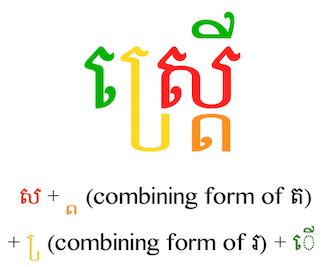
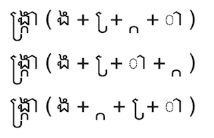

## Khmer Syllable Reordering for Search ##

September 2021

By [Trey Jones](https://github.com/Trey314159).

This library provides implementations in Java, Perl, and (eventually) Python to
reorder syllables in Khmer script for the *purposes of search.* Characters are
reordered in canonical order; duplicate characters (especially diacritics) are
removed; invisible characters are removed; variant, obsolete, and deprecated
characters are replaced or removed.

The algorithm is perhaps a little aggressive for non-search applications; some
of the normalizations would change the appearance of syllables. More details on
non-search usage are below.

### Background ###

Khmer, also called Cambodian, is the official language of Cambodia. The **[Khmer
script](https://en.wikipedia.org/wiki/Khmer_script)** is a syllabary closely
related to Thai and Lao and more distantly to all the [Brahmic
scripts](https://en.wikipedia.org/wiki/Brahmic_scripts#Comparison). Khmer is
written left to right, and often without spaces between words.

Khmer *orthographic syllables* are built around a *base character* that
represents a consonant and a vowel. Up to two additional subscript consonants
may be added to the onset of the syllable by stacking them underneath the base
character (usually—sometimes they go to the side of the base character), and the
vowel of the base character can be changed by adding other characters to the
base character. Other diacritics may also be added to alter the pronunciation of
the consonant or vowel.

In the first example below, the base character, ស "sa", is in red. The first
subscripted consonant, ត "ta" (in orange), goes below the base character. The
second subscripted consonant, រ "ro" (in yellow), goes mostly to the left,
though a bit of it is below the base character. The vowel sign, ើ "oe" (in
green), is in two parts—one goes to the left of everything else, and the other
goes above the base character.

Different fonts and different operating systems support typing the [code
points](https://en.wikipedia.org/wiki/Code_point) of an orthographic syllable in
different orders, in that they will render the resulting syllable the same (or
very nearly the same). This happens because—to simplify a bit—there isn't really
an obvious linear order to elements that glom on top, to the left, and below the
base character.

The second example above shows three different versions of the same
syllable.These three different underlying sequences of characters could look
exactly the same on-screen.

The Unicode Standard sets out a preferred order, which corresponds to the order
the elements are spoken (though there seem to still be some elements that are
ordered arbitrarily). Incorrect ordering *should* result in glyphs with a
dotted circle (◌) showing that they aren't combining correctly, but many fonts,
applications, and OSes will still render non-canonical orders perfectly fine, or
at least reasonably well, and some don't show the dotted circle even when they
render poorly.

Another issue is that for some of the diacritics, multiple copies will render
directly on top of each other so that you can't see that there are multiple
copies of the diacritic. This can apply to vowels, subscript consonants, and
other diacritics.

All of this variability causes great difficulty in **search,** because two words
that look exactly the same could underlyingly be composed of very different
sequences of code points.

A similar but much smaller scale problem in English is that é can be either a
single character or two characters (e + ´) composed together. A more analogous
example would be if the character sequences *strap, srtap, satrp,* and
*straaaaap* all looked identical on-screen.

### Algorithm ###

* **Define useful character classes**
  * consonants = ក ខ គ ឃ ង ច ឆ ជ ឈ ញ ដ ឋ ឌ ឍ ណ ត ថ ទ ធ ន ប ផ ព ភ ម យ រ ល វ ឝ ឞ ស
  ហ ឡ អ [U+1780–U+17A2]
    * ro = រ [U+179A]
  * independent vowels = ឣ ឤ ឥ ឦ ឧ ឨ ឩ ឪ ឫ ឬ ឭ ឮ ឯ ឰ ឱ ឲ ឳ [U+17A3–U+17B3]
    * The first two are deprecated and shouldn't occur after regularization
  * dependent vowels = ា ិ ី ឹ ឺ ុ ូ ួ ើ ឿ ៀ េ ែ ៃ ោ ៅ [U+17B6–U+17C5]
  * coeng =  ្  [U+17D2]
  * diacritics =  ំ  ះ  ៈ  ៉  ៊  ់  ៌  ៍  ៎  ៏  ័  ៑ [U+17C6–U+17D1 U+17DD]
    * register shifters = [U+17C9 U+17CA]
    * robat = [U+17CC]
    * non-spacing diacritics = [U+17C6 U+17CB U+17CD–U+17D1 U+17DD]
    * spacing diacritics = [U+17C7 U+17C8]
  * zero-width elements = zero width space (ZWSP), zero width non-joiner (ZWNJ),
  zero-width joiner (ZWJ), soft-hyphen (SHY), invisible separator (InvSep)
  [U+200B–U+200D U+00AD U+2063]†

<small>[†] Some of the zero-width elements may be useful in presentation of
Khmer script. Any of them may prevent font rendering from forming ligatures, and
the soft-hyphen provides an option for more visually pleasing line breaks, as in
English text. All of them are removed for search purposes; some may change the
appearance of the text as written.</small>

* **Regularize the text**
  * replace obsolete ligature ឨ (U+17A8) with ឧក (U+17A7 U+1780)‡
  * replace deprecated independent vowel ឣ (U+17A3) with អ (U+17A2)
  * replace deprecated independent vowel digraph ឤ (U+17A4) with អា (U+17A2
  U+17B6)
  * replace ឲ (U+17B2) as a variant of ឱ (U+17B1)‡
  * replace deprecated trigraph ៘ (U+17D8) with ។ល។ (U+17D4 U+179B U+17D4)
  * delete non-visible inherent vowels (឴) (U+17B4) and (឵) (U+17B5) (used for
  transliteration)
  * replace obsolete ATTHACAN ៝ (U+17DD) with VIRIAM   ៑ (U+17D1)‡
  * replace deprecated BATHAMASAT  ៓ (U+17D3) with NIKAHIT  ំ (U+17C6) as a
  likely error

<small>[‡] These three changes may be too aggressive for non-search usage, since
they change the appearance of the text as written.</small>

* **Find syllables**
  * A syllable is a consonant or independent vowel followed by any sequence of
  coeng(s)+consonant clusters, coeng(s)+independent vowel clusters, dependent
  vowels, diacritics, or zero-width elements.
    * coeng(s) are 1 or more coengs. There *should* be only one, but they are
    often invisible, and I've seen as many as three used at once.

**KNOWN BUG:** Finding syllables works well for reasonably formatted text, but
when there are certain typos—in particular a missing base consonant in the next
syllable—this can gather up too many vowels. At the moment, the algorithm just
lets typos do silly things, as typos often do. (We want to catch duplicate
vowels and split vowels, so we do need to allow multiple vowels in some cases.)

* **Reorder each syllable**
  * remove zero-width elements
  * save the first character (consonant or independent vowel) as the base
  character
  * split the remainder of the syllable into chunks
    * coeng(s) + (consonant or independent vowel) + register shifter
    * coeng(s) + (consonant or independent vowel)
    * everything else splits into one-character chunks
  * collect the chunks, in their original order, into the following groups:
    * chunks starting with a coeng
      * deduplicate coengs within these chunks
    * dependent vowels
    * other register shifters
    * robats
    * non-spacing diacritics
    * spacing diacritics
    * [note that there shouldn't be any leftovers]
  * de-duplicate each group
    * if the same chunk occurs multiple times in a row, reduce it to one
    instance
  * repair split vowels
    * replace  េ +  ី (U+17C1 U+17B8) with  ើ (U+17BE)
    * replace  ី +  េ (U+17B8 U+17C1) with  ើ (U+17BE)
    * replace  េ +  ា (U+17C1 U+17B6) with  ោ (U+17C4)
  * reorder subscript consonants (ro is always last)
    * if coeng + ro comes before coeng + consonant, swap them
  * join the elements: base character + other register shifters + robat + coeng
  chunks + dependent vowels + non-spacing diacritics + spacing diacritics
    * note that some register shifters could be in the coeng chunks

#### Caveats ####

* As noted above, especially in the footnotes, some parts of the normalization
may be too aggressive for non-search usage.

* The current algorithm was partly based on the references I found, and partly
data-driven, so it doesn't cover all possible cases, but it covers everything I
found in my Khmer Wikipedia data, except for the syllable boundary problem.

* The algorithm isn't perfect; see the syllable boundary problem. On the other
hand, when you have a serious typo, you have garbage in, garbage out. (In the
Khmer Wikipedia data, the syllable boundary error rate is less than 0.001% of
all syllables, so it isn't a huge concern.)

### Java Implementation ###

The algorithm is available in a Java class, `KhmerSyllableReorder.java` in the
`java/` directory. There is also a command line driver,
`CommandLineDriver.java`, and a Maven `pom.xml` file for building it. It takes a
file name on the command line and writes the rewritten text to `STDOUT`.

### Perl Implementation ###

The algorithm is available as a Perl module, `KhmerSyllableReorder.pm` in the
`perl/` directory. There is also a command line driver, `ksyll.pl`, that takes a
file name on the command line and writes the rewritten text to `STDOUT`.

### Python Implementation ###

The algorithm is available as a Python module, `KhmerSyllableReorder.py` in the
`python/` directory. There is also a command line driver, `ksyll.py`, that takes a
file name on the command line and writes the rewritten text to `STDOUT`.

### Elasticsearch Plugin ###

The Java version of the algorithm has been wrapped in an Elasticsearch character
filter, called `khmer_syll_reorder`, in the `extra-analysis-khmer` plugin, in
the Wikimedia `search-extra` repo, which is available on
[GitHub](https://github.com/wikimedia/search-extra).

### Sources, References, and Links ###

Some of the material in this README is adapted or taken from the following
sources:

* [Permuting Khmer: restructuring Khmer syllables for
search](https://techblog.wikimedia.org/2020/06/02/permuting-khmer-restructuring-khmer-syllables-for-search/)—a
blog post I wrote about this work.
* [Khmer Reordering](https://www.mediawiki.org/wiki/User:TJones_%28WMF%29/Notes/Khmer_Reordering)—my
more detailed notes that I wrote up while working on the project.

These are some references that have proven useful to me in trying to figure out Khmer syllables.

* [The order of components in Khmer orthographical
syllables](https://software.sil.org/downloads/r/mondulkiri/Mondulkiri-5.513-Ortho.pdf)
(PDF) from SIL
* [The Unicode Standard, Version 6.1—Southeast Asian
Scripts](http://www.unicode.org/versions/Unicode6.1.0/ch11.pdf) (PDF),
specifically Section 11.4
* [Ordering rules for
Khmer](http://www.open-std.org/jtc1/sc22/wg20/docs/n1076-Khmer-order11.pdf)
(PDF)
* [Report on the Current Status of United Nations Romanization Systems for
Geographical Names—Khmer](http://www.eki.ee/wgrs/rom1_km.pdf) (PDF)
* [Khmer Romanization Table - Proposed Revision
2011](https://www.loc.gov/catdir/cpso/romanization/khmerrev.pdf) (PDF)
* [Khmer character notes](https://r12a.github.io/scripts/khmer/block) from
r12a.github.io
* [Inherent Vowels](http://www.khmerfonts.info/bauhahn/InherentVowels.html) from
khmerfonts.info
